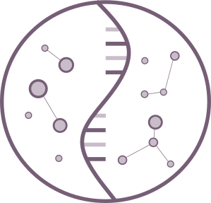
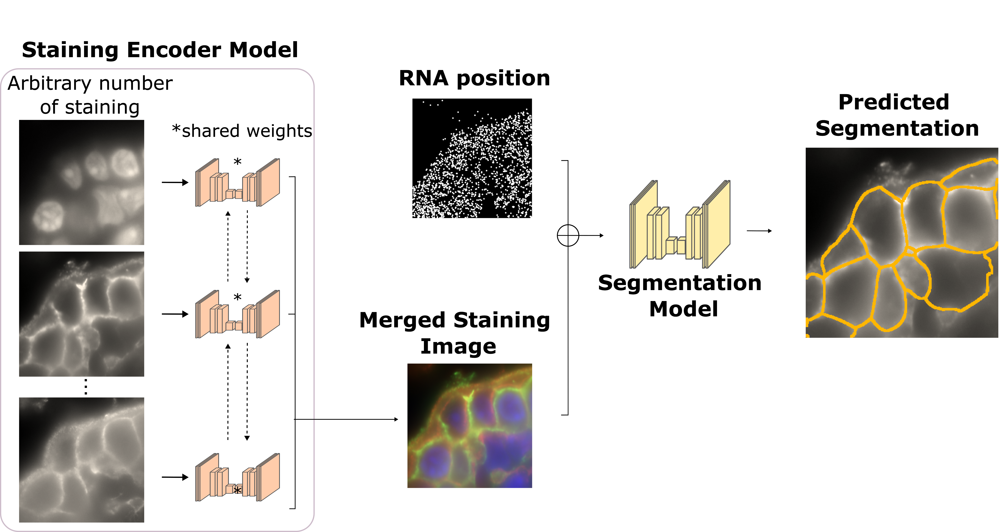

# RNA2seg - A generalist model for cell segmentation in image-based spatial transcriptomics



## Overview



**RNAseg** is a deep learning-based segmentation model designed to improve cell segmentation in **Imaging-based Spatial Transcriptomics (IST)**. Traditional IST methods rely on nuclear and membrane staining to define cell boundaries, but segmentation can be challenging due to the variable quality of membrane markers.  

RNAseg addresses this issue by integrating an **arbitrary number of staining channels** along with **RNA spatial distributions** to enhance segmentation accuracy, particularly in regions with low-quality membrane staining. It is built on **SpatialData**, enabling seamless processing and analysis of spatial transcriptomics data.  

### **Key Features:**  
- **Multi-channel input**: Leverages nuclear, membrane, and RNA spatial data.  
- **Robust segmentation**: Outperforms state-of-the-art methods across multiple datasets.  
- **Zero-shot learning**: Generalizes to unseen datasets without requiring manual annotations.  
- **Built on SpatialData**: Ensures compatibility with modern spatial transcriptomics pipelines.  

RNAseg is designed for researchers working with spatial transcriptomics data who need **accurate and adaptable segmentation** across different experimental conditions.


## Documentation

Check RNA2seg's [documentation]() to get started. It contains installation explanations and tutorials.

## Installation

## Features

## Citation

If you use this library, please be sure to cite:

```
@article{}
```

## Datasets

All datasets, required to reproduce the results of publication "RN2Aseg: a generalist model for cell segmentation1
in image-based spatial transcriptomics2" are available at ...