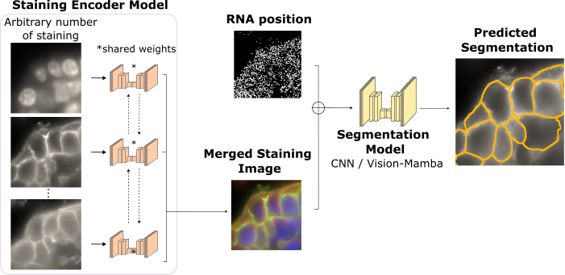

.. RNA2seg documentation master file, created by
   sphinx-quickstart on Tue Feb 11 16:27:05 2025.
   You can adapt this file completely to your liking, but it should at least
   contain the root `toctree` directive.

Welcome to RNA2seg's documentation!
===================================

**RNA2seg** is a deep learning-based segmentation model designed to improve cell segmentation in **Imaging-based Spatial Transcriptomics (IST)**. Traditional IST methods rely on nuclear and membrane staining to define cell boundaries, but segmentation can be challenging due to the variable quality of membrane markers.  

RNA2seg addresses this issue by integrating an **arbitrary number of staining channels** along with **RNA spatial distributions** to enhance segmentation accuracy, particularly in regions with low-quality membrane staining. It is built on **SpatialData**, enabling seamless processing and analysis of spatial transcriptomics data.  

Check out the :doc:`install` section for further information about how to install the package.

Contents
===================================

.. toctree::
   :maxdepth: 2
   :caption: Contents:

.. toctree::

   install
   userguide
   pretrained_model
   module_rna2seg
   
Support
==================

If you have any questions relative to the package, please open an issue on  `GitHub <https://github.com/fish-quant/rna2seg>`_.

Citation
==================

If you use this library, please be sure to cite:

.. code-block:: text

   @article{
       author = {Thomas Defard, Alice Blondel, Anthony Coleon, Guilherme Dias de Melo, Thomas Walter, Florian Mueller},
       title = {RNA2seg: a generalist model for cell segmentation in image-based spatial transcriptomics},
       journal = {Journal Name},
       year = {2025},
       volume = {50},
       pages = {123-130}
   }

Indices and tables
==================

* :ref:`genindex`
* :ref:`modindex`
* :ref:`search`

